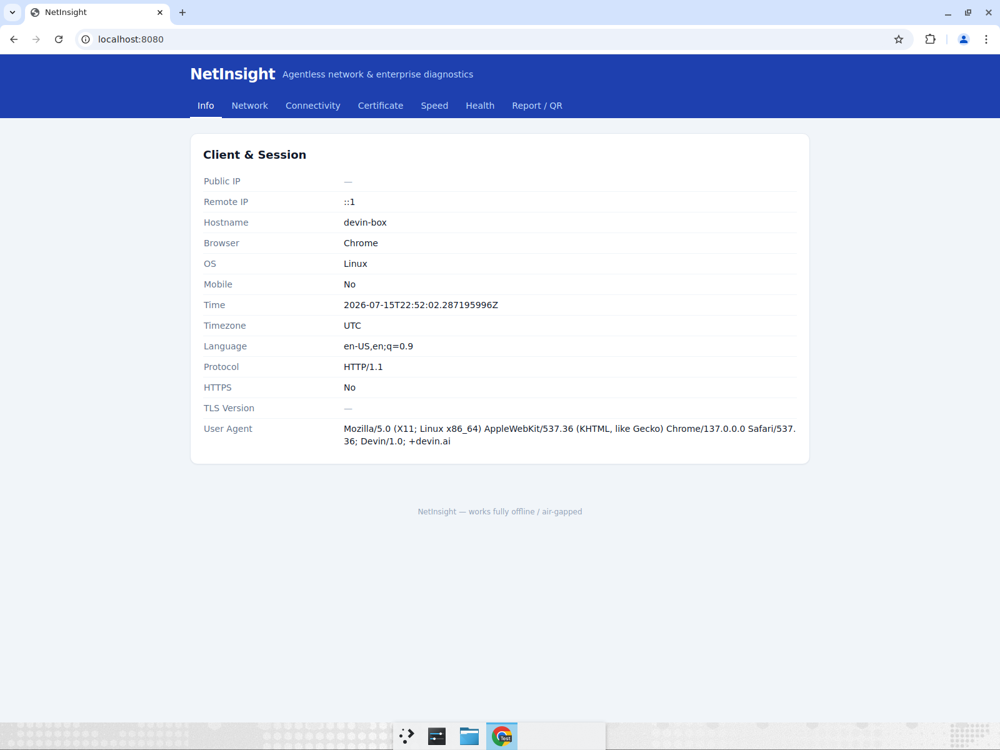
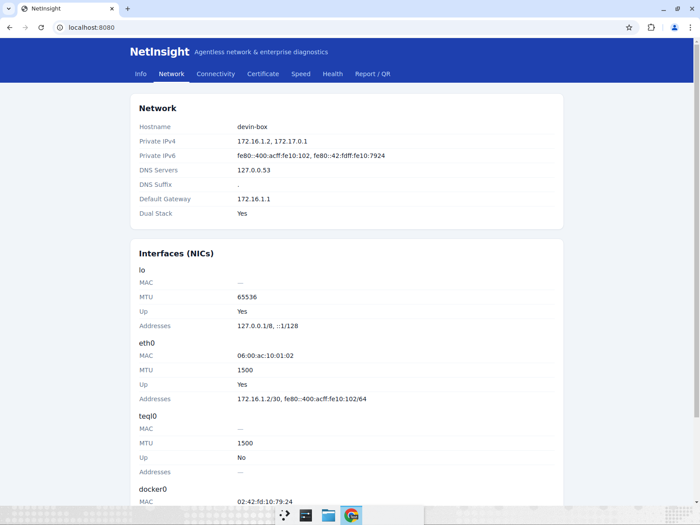
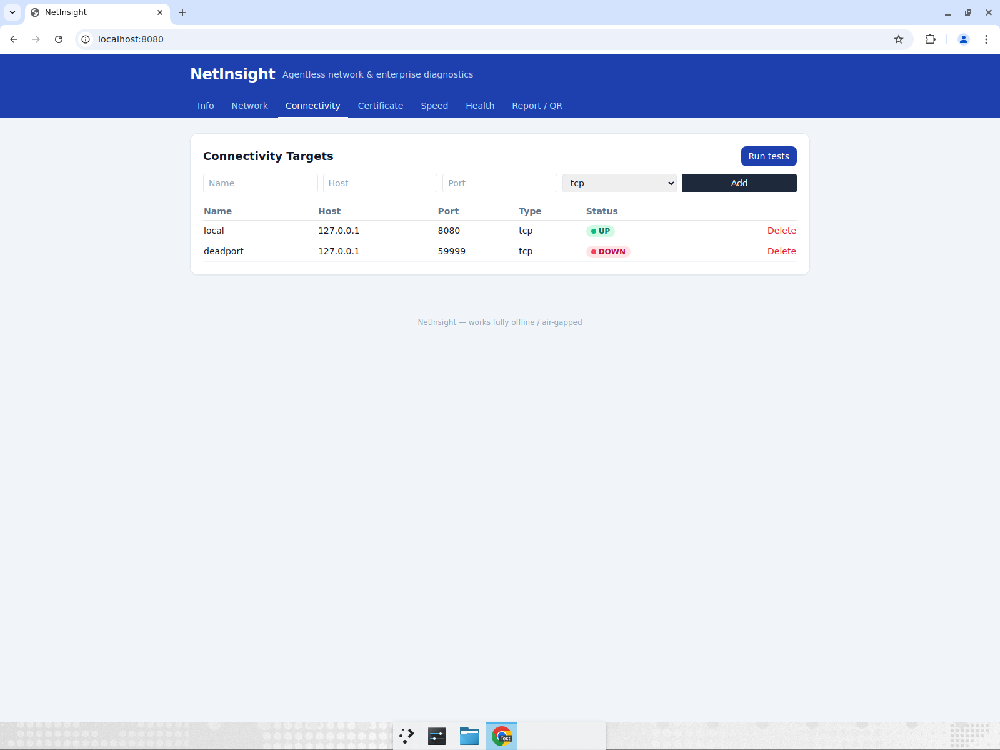
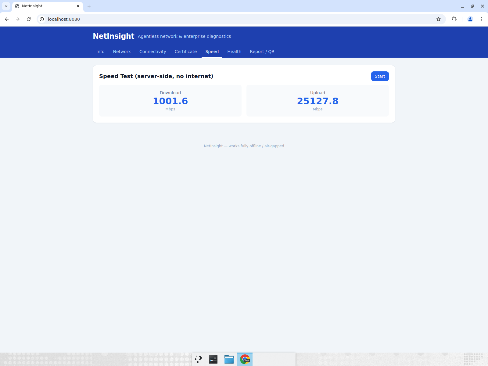
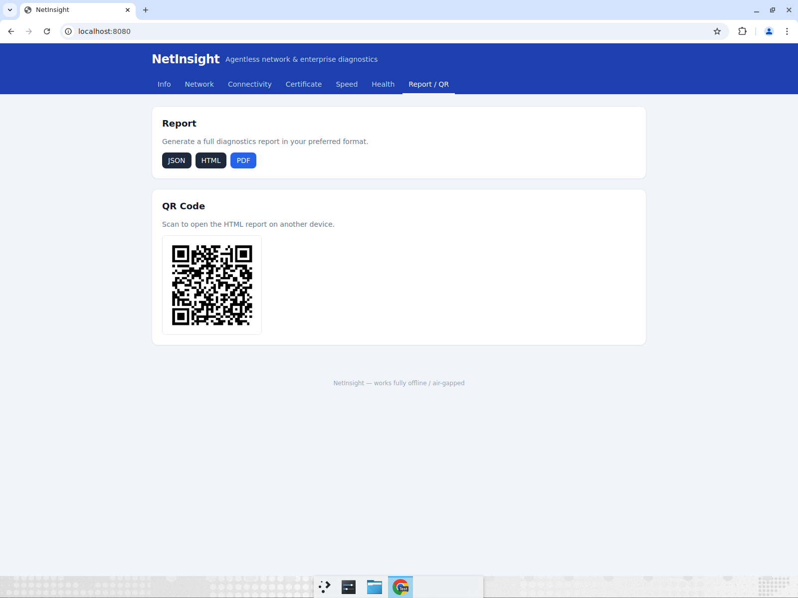

# NetInsight

Agentless network & enterprise diagnostics that runs entirely inside a single
Docker container — designed to work in fully isolated / **air-gapped** networks.
A user just opens a page in their browser; NetInsight reports both client-side
details (browser, IP, TLS…) **and** runs server-side network probes so a
HelpDesk / NOC operator gets a complete picture **without installing an agent on
the client**.

```bash
docker run -d -p 8080:80 ghcr.io/wivotelecom/mam:latest
# then open http://<host>/
```

Everything works offline. The only optional online lookup is the public IP,
which fails gracefully (and can be disabled entirely).

## Demo

https://github.com/WiVotelecom/MAM/raw/main/docs/media/netinsight-demo.mp4

A full walkthrough of every page (video: [`docs/media/netinsight-demo.mp4`](docs/media/netinsight-demo.mp4)).

| Info | Network |
| --- | --- |
|  |  |
| **Connectivity** | **Speed** |
|  |  |
| **Report / QR** | |
|  | |

## Features

| Page | What it shows |
| --- | --- |
| **Info** | Public IP, Remote IP, hostname, browser, OS, protocol, HTTPS, TLS version, language, time/timezone, user agent |
| **Network** | Private IPv4/IPv6, DNS servers, DNS suffix, default gateway, NICs (MAC/MTU/addresses), dual-stack detection |
| **Connectivity** | Admin-defined targets (DC01, Exchange, FileServer, ERP, GitLab, vCenter, FortiGate, Splunk…) probed server-side via TCP/DNS/LDAP/HTTPS/SSH/RDP/WinRM/SMB/SQL/… |
| **Certificate** | TLS version, cipher, full chain, subject, issuer, SAN, expiry & days-left |
| **Speed** | Self-contained download/upload throughput test — no internet or external speed-test server |
| **Health** | At-a-glance UP/DOWN dashboard aggregating all configured checks |
| **Report / QR** | One-click JSON / HTML / PDF report + a QR code to open it on another device |

## API

All endpoints return JSON unless noted.

| Endpoint | Description |
| --- | --- |
| `GET /api/info` | Client + session details |
| `GET /api/network` | Host network configuration |
| `GET /api/browser` | Parsed User-Agent details |
| `GET /api/health` | Aggregated health of configured targets |
| `GET /api/connectivity` | Runs probes against all enabled targets |
| `GET /api/certificate?host=&port=` | Inspect a TLS endpoint |
| `GET /api/targets` / `POST /api/targets` / `DELETE /api/targets/{id}` | Manage connectivity targets |
| `GET /api/speed/download?size=` / `POST /api/speed/upload` | Server-side speed test |
| `GET /api/report?format=json\|html\|pdf` | Full diagnostics report |
| `GET /api/qr?content=` | PNG QR code |

## Architecture

- **Backend:** Go — a single static binary (`CGO_ENABLED=0`), pure-Go SQLite
  (`modernc.org/sqlite`), suitable for air-gap.
- **Frontend:** React + Tailwind CSS (Vite), built and **embedded** into the Go
  binary via `go:embed`, so there are no external asset dependencies at runtime.
- **API:** REST over the Go 1.22+ standard-library router.
- **Storage:** SQLite (no server to install) for admin-defined targets.
- **Deployment:** Docker & Docker Compose.

```
cmd/netinsight        # entrypoint
internal/server       # HTTP API + SPA hosting
internal/sysinfo      # host/network info (interfaces, resolv.conf, routes)
internal/connectivity # target reachability probes
internal/certs        # TLS certificate inspection
internal/speed        # self-contained throughput test
internal/report       # JSON/HTML/PDF report + QR
internal/store        # SQLite config store
internal/uaparse      # User-Agent parser
web/                  # go:embed of the built frontend
frontend/             # React + Tailwind source
```

## Configuration

| Env var | Flag | Default | Notes |
| --- | --- | --- | --- |
| `NETINSIGHT_ADDR` | `-addr` | `:8080` | Listen address |
| `NETINSIGHT_DB` | `-db` | `/data/netinsight.db` | SQLite path |
| `NETINSIGHT_PUBLIC_IP_URL` | `-public-ip-url` | `https://api.ipify.org` | Set **empty** to disable the public-IP lookup (air-gap) |

## Development

Prerequisites: Go 1.23+ and Node 20+.

```bash
# Backend tests
go test ./...

# Frontend (dev server proxies /api to :8080)
cd frontend && npm install && npm run dev

# Build frontend into the Go embed dir, then build the binary
cd frontend && npm run build && cd ..
go build -o bin/netinsight ./cmd/netinsight
./bin/netinsight -addr :8080 -db ./netinsight.db -public-ip-url ""
```

### Docker

```bash
docker compose up --build      # serves on http://localhost/
# or
docker build -t netinsight . && docker run -d -p 80:8080 netinsight
```

## Roadmap

Planned for subsequent iterations:

- WebSocket live status streaming for probes
- Plugin system (FortiGate, FortiWeb, Exchange, vCenter, Nutanix, Proxmox,
  Cisco, Splunk, ManageEngine, Zabbix)
- Full Enterprise/AD diagnostics (Site, Logon Server, Kerberos, NTP, SMB,
  printer discovery)
- Offline MaxMind GeoIP database (optional)
- Proxy / PAC / WPAD / WebRTC / DNS-leak detection
